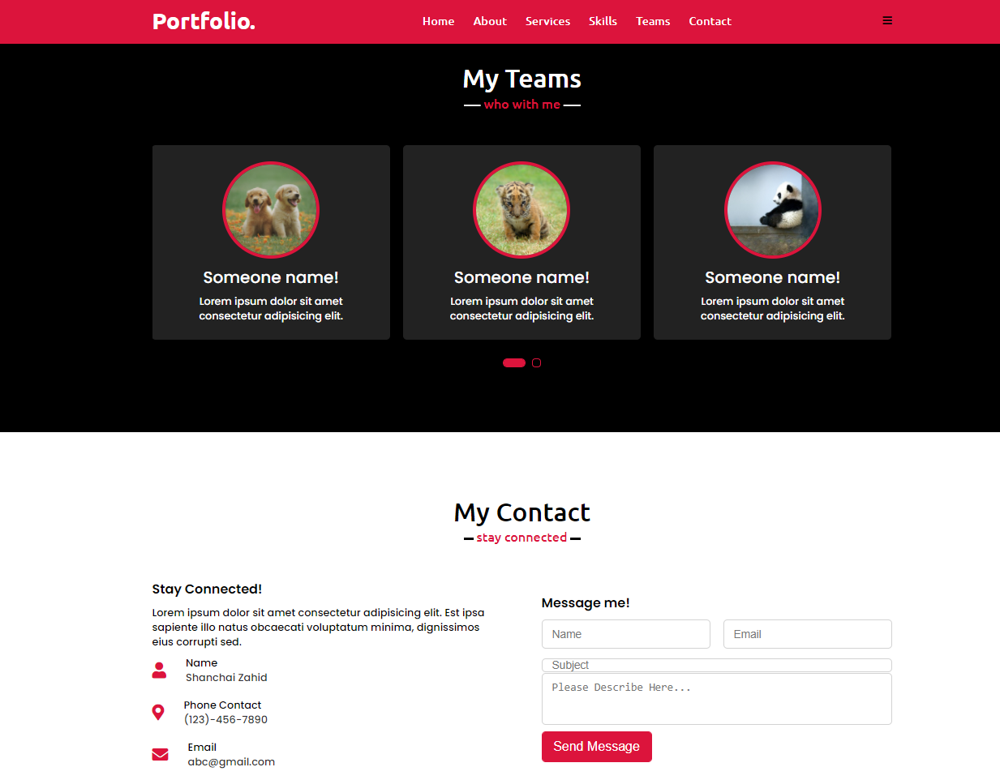

WebDev: Portfolio Page

# Introduction:
Building a Portfolio Website is essential for a webdeveloper as this website displays the individual's compelling work (a showcase) while providing basic information to potential clients.

# The Project's Aim:
The aim of this project is to draft a deployed portfolio website to a pontential employee so that the employer can review samples of their work and assess their candidacy for an open position.

# Technologies used:
- HTML - Base webpage skeleton
- CSS - Design
- Font Awesome - Icons
- JavaScript - Navbar, scrolling, and carousel behaviour
- JQuery - for the Owl Carousel in teams section behaviour

# Screenshots:

# Deployed Link:

https://shanchaiz.github.io/Portfolio/